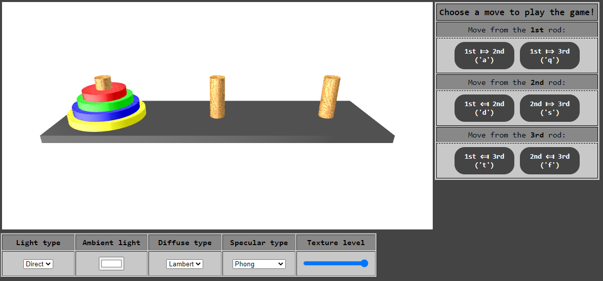

# Tower of Hanoi Project - Computer Graphics Course @Polimi (AY 2020-2021)

## Introduction
The Tower of Hanoi is a mathematical puzzle. It consists of three rods and a number of discs (in our case 4 discs) of different sizes, which can slide onto any rod. The puzzle starts with the discs in a stack in ascending order of size on the first rod, with the smallest at the top (thus making a conical shape).

The objective of the game is to move the entire stack to another rod, obeying the following simple rules:
1. only one disc can be moved at a time;
2. each move consists of taking the upper disc from one of the rods and placing into another rod;
3. no disc can be placed on top of a smaller disc.

## Ways of control 
1. You can drag the screen by mouse to adjust the camera view;
2. you can click buttons on the right side of the web page (or press keys denoted in texts of buttons) to move discs;
3. you can change:
    - the light type (Direct or Point),
    - the ambient light color,
    - the diffuse type (Lambert, Toon, or no diffuse),
    - the specular type (Phong, Blinn, Toon Phong, Toon Blinn, or no specular),
    - the texture level of the rods (through a slider).

## Screenshot
Here follows a screenshot of the application:

## Shading Space
The shading space adopted in this project is WORLD SPACE.

## Projection Type
The projection type adopted in this project is PERSPECTIVE PROJECTION.
